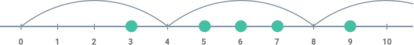

<h2>Avoid Obstacles</h2>

You are given an array of integers representing coordinates of obstacles situated on a straight line.

Assume that you are jumping from the point with coordinate <code>0</code> to the right. You are allowed only to make jumps of the same length represented by some integer.

Find the minimal length of the jump enough to avoid all the obstacles.

Example

For <code>inputArray = [5, 3, 6, 7, 9]</code>, the output should be 
<code>avoidObstacles(inputArray) = 4</code>.

Check out the image below for better understanding:

Input/Output

<ul>
<li>

<strong>[execution time limit] 4 seconds (js)</strong>

</li>
<li>

<strong>[input] array.integer inputArray</strong>

Non-empty array of positive integers.

<em>Guaranteed constraints:</em> 
<code>2 ≤ inputArray.length ≤ 1000</code>, 
<code>1 ≤ inputArray[i] ≤ 1000</code>.

</li>
<li>

<strong>[output] integer</strong>

<ul>
<li>The desired length.</li>
</ul>
</li>
</ul>

