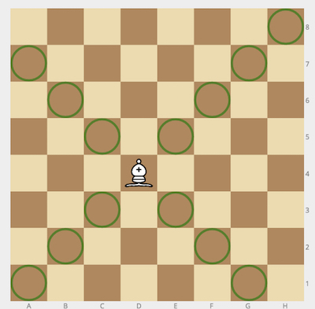

<h2>Bishop and Pawn</h2>

On a standard 8×8 chess board, a white <code>bishop</code> and a black <code>pawn</code> occupy two squares. Decide whether the bishop can take the pawn in a single move.

Bishops move any number of squares along a diagonal (no jumping over pieces is relevant here—only whether the pawn lies on the bishop's diagonal). The diagram shows valid bishop paths:

Example

<ul>
<li>

For <code>bishop = "f1"</code> and <code>pawn = "a6"</code>, the output should be 
<code>bishopAndPawn(bishop, pawn) = true</code>.

</li>
<li>

For <code>bishop = "g1"</code> and <code>pawn = "f3"</code>, the output should be 
<code>bishopAndPawn(bishop, pawn) = false</code>.

</li>
<li>

For <code>bishop = "c1"</code> and <code>pawn = "f4"</code>, the output should be 
<code>bishopAndPawn(bishop, pawn) = true</code>.

</li>
</ul>

Input/Output

<ul>
<li>

<strong>[execution time limit] 4 seconds (js)</strong>

</li>
<li>

<strong>[input] string bishop</strong>

Location of the white bishop in <a href="keyword://chess-notation" target="_blank">chess notation</a> (file letter + rank digit).

<em>Guaranteed constraints:</em> 
<code>bishop.length = 2</code>, 
<code>'a' ≤ bishop[0] ≤ 'h'</code>, 
<code>1 ≤ bishop[1] ≤ 8</code>.

</li>
<li>

<strong>[input] string pawn</strong>

Location of the black pawn, using the same notation.

<em>Guaranteed constraints:</em> 
<code>pawn.length = 2</code>, 
<code>'a' ≤ pawn[0] ≤ 'h'</code>, 
<code>1 ≤ pawn[1] ≤ 8</code>.

</li>
<li>

<strong>[output] boolean</strong>

<ul>
<li><code>true</code> if the bishop can capture the pawn in one move, <code>false</code> otherwise.</li>
</ul>
</li>
</ul>

<strong>Run test:</strong> <code>../vendor/bin/phpunit -c ../phpunit.xml php/BishopAndPawnTest.php</code>

