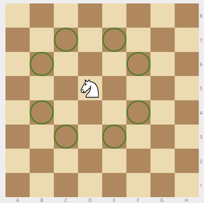
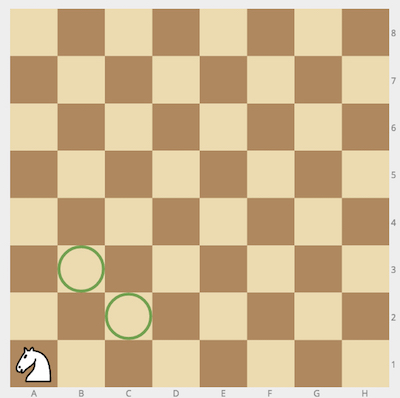
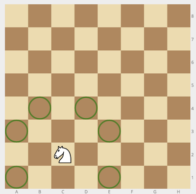

<h2>Chess Knight</h2>

Given a position of a knight on the standard chessboard, find the number of different moves the knight can perform.

The knight can move to a square that is two squares horizontally and one square vertically, or two squares vertically and one square horizontally away from it. The complete move therefore looks like the letter L. Check out the image below to see all valid moves for a knight piece that is placed on one of the central squares.

Example

<ul>
<li>

For <code>cell = "a1"</code>, the output should be 
<code>chessKnight(cell) = 2</code>.

</li>
<li>

For <code>cell = "c2"</code>, the output should be 
<code>chessKnight(cell) = 6</code>.

</li>
</ul>

Input/Output

<ul>
<li>

<strong>[execution time limit] 4 seconds (js)</strong>

</li>
<li>

<strong>[input] string cell</strong>

String consisting of 2 letters - coordinates of the knight on an <code>8 × 8</code> chessboard in <a href="keyword://chess-notation" target="_blank">chess notation</a>.

<em>Guaranteed constraints:</em> 
<code>cell.length = 2</code>, 
<code>'a' ≤ cell[0] ≤ 'h'</code>, 
<code>1 ≤ cell[1] ≤ 8</code>.

</li>
<li>

<strong>[output] integer</strong>

</li>
</ul>

