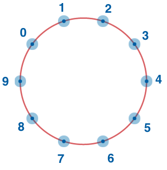

<h2>Circle of Numbers</h2>

Integers from <code>0</code> through <code>n - 1</code> are placed evenly around a circle, so consecutive numbers (including <code>0</code> and <code>n - 1</code>) are neighbors with equal spacing.

Given <code>n</code> and a starting label <code>firstNumber</code>, return the label written directly across the circle—the number opposite <code>firstNumber</code>.

Example

<ul>
<li>For <code>n = 10</code> and <code>firstNumber = 7</code>, the output should be 
<code>circleOfNumbers(n, firstNumber) = 2</code>.</li>
<li>For <code>n = 4</code> and <code>firstNumber = 1</code>, the output should be 
<code>circleOfNumbers(n, firstNumber) = 3</code>.</li>
<li>For <code>n = 6</code> and <code>firstNumber = 3</code>, the output should be 
<code>circleOfNumbers(n, firstNumber) = 0</code>.</li>
</ul>

Input/Output

<ul>
<li>

<strong>[execution time limit] 4 seconds (js)</strong>

</li>
<li>

<strong>[input] integer n</strong>

A positive <strong>even</strong> integer—the count of numbers on the circle.

<em>Guaranteed constraints:</em> 
<code>4 ≤ n ≤ 20</code>.

</li>
<li>

<strong>[input] integer firstNumber</strong>

One of the labels on the circle.

<em>Guaranteed constraints:</em> 
<code>0 ≤ firstNumber ≤ n - 1</code>.

</li>
<li>

<strong>[output] integer</strong>

The label opposite <code>firstNumber</code>.

</li>
</ul>

<strong>Run test:</strong> <code>../vendor/bin/phpunit -c ../phpunit.xml php/CircleOfNumbersTest.php</code>

